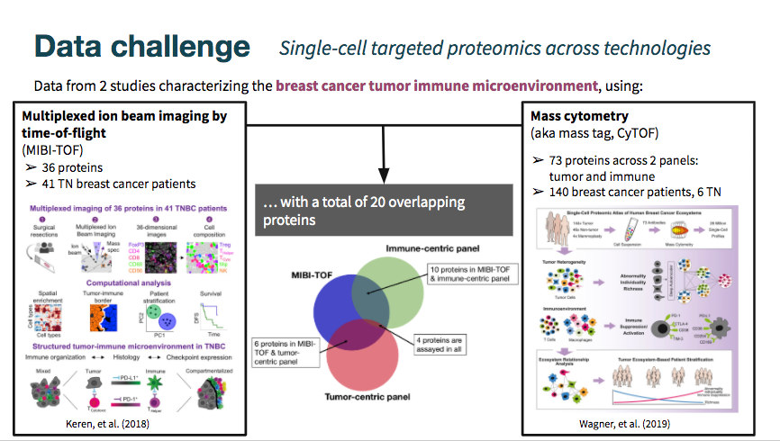
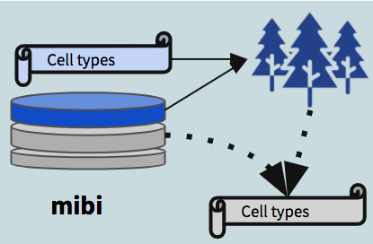
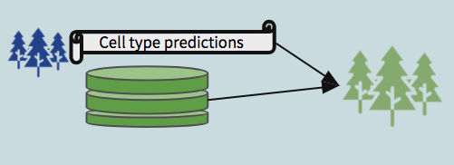

```{r setup, include=FALSE}
knitr::opts_chunk$set(echo = TRUE)
```

# Introduction

{ width=95% }

Visit the [BIRSBiointegration Hackathon page](https://github.com/BIRSBiointegration/Hackathon) to read more about these datasets.

The MIBI-TOF dataset came annotated with cell type classifications, while the cyTOF datasets did not include them. As shown in the Venn diagram above, there is some overlap in markers measured across datasets, but still limited intersection. 

The mibi-tof dataset comprised a single panel of 36 proteins.

The cytof datasets included data from two different panels, totalling 73 proteins. See the hackathon page linked above for a detailed description of the datasets.

In this vignette we examine the robustness of predictions between datasets, given limited overlap in shared markers.

{ width=95% }

In total, we built three sets of random forest models:

0. Trained on *mibi data* using all the features captured in the mibi dataset, used to demonstrate the that within mibi alone, cell types can be predicted. We also expect this model to provide an estimate on the upper bound of how well we could expect cross-dataset models to perform.
1. Trained on *mibi data* using the intersecting features between mibi and the respective cytof dataset, with the *"ground truth" labels*, used to predict cell types in the cytof dataset (no labels given). 
{ width=20% }
2. Trained on the *cytof data* using the same set of features as model 1, with the *predicted labels* generated from the first model, treating them as "ground truth" for the purposes of model building.
{ width=20% }


We then use the second model to predict labels for the mibi dataset (dotted arrow in the schematic diagram). These predictions, when compared with the actual labels, provide a view into the robustness of shared structure in the data with respect to the defined groups.

{ width=40% }

# Set-up

```{r package_load, message = F}
library(corral)
library(SingleCellExperiment)
library(ggplot2)
library(reshape2)
library(scater)
library(ggthemes)
library(pals)
library(ComplexHeatmap)
library(caret)
library(randomForest)
```

Make sure that you download the hackathon data files and add them to the `data` folder.

Download data here: https://drive.google.com/open?id=1Qb6VgVkWfy2x5Dr7kzqMAfzOLas1G6v-

Read more about the datasets and the challenge: https://github.com/BIRSBiointegration/Hackathon/tree/master/sc-targeted-proteomics

```{r data_load, eval = F}
load('../data/mibiSCE.rda')
load('../data/masstagSCE.rda')
```

Some of the protein names don't match exactly between the two batches. To correct this, we will re-map them. We also normalize the expression values between 0 and 1 to correct differences in scale between the datasets.

```{r eval = F}
datnames <- c('mibi','livecells','tcell','cd45','myeloid','epith')

map_from <- c('HLADR', 'FOXP3', 'HLA-DR','CD279 (PD_1)', 'CD274 (PD_L1)', 'CD8a','PD-L1')
map_to <- c('HLA_DR', 'FoxP3', 'HLA_DR', 'PD1', 'PD_L1', 'CD8','PD_L1')

for(dn in datnames){
  objn <- paste0(dn,'.sce')
  sce <- eval(as.name(objn))
  mat <- t(apply(assay(sce), FUN = norm01, MARGIN = 1))
  assay(sce) <- mat
  inds_map <- which(map_from %in% rownames(sce))
  rownames(sce) <- plyr::mapvalues(x = rownames(sce),from = map_from[inds_map], to = map_to[inds_map])
  assign(objn, sce)
}

consolidated <- colData(mibi.sce)$tumor_group
consolidated[which(consolidated == "Immune")] <- colData(mibi.sce)$immune_group[which(consolidated == "Immune")]
colData(mibi.sce)$consolidated <- consolidated

```


# 0. RF model trained on mibi data

## Setting up data for random forest

```{r data_prep_rf, eval = F}
xprmat <- t(assay(mibi.sce)[which(rowData(mibi.sce)$is_protein == 1),])
colnames(xprmat) <- rownames(mibi.sce)[which(rowData(mibi.sce)$is_protein == 1)]

mibi_full <- cbind(colData(mibi.sce)[,c('SampleID','cellLabelInImage','tumor_group','immune_group')],
                   consolidated,
                   xprmat)[which(mibi.sce$SampleID < 41),]

mibi_dat <- mibi_full[,5:43]
mibi_dat$consolidated <- as.factor(mibi_dat$consolidated)
```

picking train/test inds
```{r pick_train_inds, eval = F}
set.seed(2020)

frac <- .8
train_inds <- sample(1:nrow(mibi_full), round(frac * nrow(mibi_full)), replace = FALSE)
test_inds <- setdiff(1:nrow(mibi_full), train_inds)
```


## Building basic model

including all features
```{r basic_rf, eval = F}
set.seed(1234)

rf_mod <- randomForest::randomForest(consolidated ~ ., 
                data = mibi_dat[train_inds,], 
                ntree = 100, 
                importance = TRUE)

varImpPlot(rf_mod)

rf_imp <- randomForest::importance(rf_mod)
rf_imp <- data.frame(Variables = rownames(rf_imp), rf_imp)

ggplot(rf_imp, aes(x = reorder(Variables, MeanDecreaseGini), 
    y = MeanDecreaseGini)) +
  geom_bar(stat='identity', colour = 'black') +
  labs(x = 'Variables', title = 'Relative Variable Importance') +
  coord_flip()
```

predictions on holdout

```{r basic_rf_results, eval = F}
# predict the outcome on test set
basic_rf_pred <- predict(rf_mod, mibi_dat[test_inds,])

# compare predicted outcome and true outcome
basic_rf_cm <- confusionMatrix(basic_rf_pred, as.factor(mibi_dat$consolidated[test_inds]))

rf_cm_pct <- sweep(basic_rf_cm$table,MARGIN = 1, STATS = rowSums(basic_rf_cm$table),FUN = '/')

gg <- ggplot(melt(rf_cm_pct), aes(Prediction, Reference, fill = value)) + 
    theme(axis.text.x = element_text(angle = 90, hjust = 1)) + 
    geom_tile() #+ scale_fill_viridis_b()
gg

# setting correct predictions to 0 to increase contrast
rf_cm_pct_contrast <- rf_cm_pct
diag(rf_cm_pct_contrast) <- 0 
gg <- ggplot(melt(rf_cm_pct_contrast), aes(Prediction, Reference, fill = value)) + 
    theme(axis.text.x = element_text(angle = 90, hjust = 1)) + 
    geom_tile() #+ scale_fill_viridis_b()
gg

ggplot(melt(rf_cm_pct_contrast), aes(x = value, y = Reference, fill = Prediction)) + 
  geom_bar(position = 'fill', stat = 'identity') +
  ggtitle('Distribution of incorrect predictions', subtitle = 'correct predictions are removed\nvalue is in percentage within each cell type')

ggplot(melt(rf_cm_pct_contrast), aes(x = value, y = Reference, fill = Prediction)) + 
  geom_bar(position = 'stack', stat = 'identity') +
  ggtitle('Distribution of incorrect predictions', subtitle = 'correct predictions are removed\nvalue is in percentage within each cell type')

rf_cm_contrast <- basic_rf_cm$table
diag(rf_cm_contrast) <- 0

ggplot(melt(rf_cm_contrast), aes(x = value, y = Reference, fill = Prediction)) + 
  geom_bar(position = 'stack', stat = 'identity') +
  ggtitle('Distribution of incorrect predictions', subtitle = 'correct predictions are removed\nvalue is in number of cells')

ggplot(melt(rf_cm_contrast/sum(rf_cm_contrast)), aes(x = value, y = Reference, fill = Prediction)) + 
  geom_bar(position = 'stack', stat = 'identity') +
  ggtitle('Distribution of incorrect predictions', subtitle = 'correct predictions are removed\nvalue is in percent across all errors\n(basically another way of looking at confusion matrix)')

rf_cm_withcorrect <- basic_rf_cm$table
diag(rf_cm_withcorrect) <- 0
rf_cm_withcorrect <- data.frame(cbind(diag(basic_rf_cm$table),rf_cm_withcorrect))

ggplot(melt(data.frame(celltype = rownames(rf_cm_withcorrect),rf_cm_withcorrect), id.vars = c('celltype')),
  aes(x = value, y = celltype, fill = variable)) + 
  geom_bar(position = 'stack', stat = 'identity') +
  ggtitle('Distribution of all predictions', subtitle = 'correct predictions are reclassified as V1\n(basically another way of looking at confusion matrix)')
```


```{r, eval = F}
tokeep <- c('Precision','Recall','Balanced Accuracy')

ggplot(melt(data.frame(class = rownames(basic_rf_cm$byClass),basic_rf_cm$byClass[,tokeep]), id.vars = c('class')), 
       aes(value, class, fill = variable)) + 
  geom_bar(stat = 'identity', position = position_dodge()) +
  ggtitle('Random forest on mibi prediction results on test')
```

# 1. RF model trained on mibi data

{ width=80% }

## Setting up data for random forest

```{r data_prep_rf_cytof, eval = F}
tum_mibi_full <- mibi_full

imm_mibi_full <- mibi_full

tum_int_genes <- intersect(colnames(tum_mibi_full), rownames(livecells.sce))

imm_int_genes <- intersect(colnames(imm_mibi_full), rownames(tcell.sce))

to_keep <- c('SampleID','cellLabelInImage','tumor_group','immune_group','consolidated')

# tumor panel
tum_mibi_full <- tum_mibi_full[,c(to_keep,tum_int_genes)]
tum_mibi_dat <- tum_mibi_full[,c('consolidated',tum_int_genes)]

# immune panel
imm_mibi_full <- imm_mibi_full[,c(to_keep,imm_int_genes)]
imm_mibi_dat <- imm_mibi_full[,c('consolidated',imm_int_genes)]
```

picking train/test inds
```{r pick_train_inds_cytof, eval = F}
set.seed(2020)

frac <- .8
train_inds <- sample(1:nrow(mibi_full), round(frac * nrow(mibi_full)), replace = FALSE)
test_inds <- setdiff(1:nrow(mibi_full), train_inds)
```


## Building basic model

including all features
```{r tumor + immune RF models, eval = F}
set.seed(1234)

tum_rf_mod <- randomForest::randomForest(as.factor(consolidated) ~ ., 
                data = tum_mibi_dat[train_inds,], 
                ntree = 100, 
                importance = TRUE)

varImpPlot(tum_rf_mod)

tum_rf_imp <- randomForest::importance(tum_rf_mod)
tum_rf_imp <- data.frame(Variables = rownames(tum_rf_imp), tum_rf_imp)

ggplot(tum_rf_imp, aes(x = reorder(Variables, MeanDecreaseGini), 
    y = MeanDecreaseGini)) +
  geom_bar(stat='identity', colour = 'black') +
  labs(x = 'Variables', title = 'Relative Variable Importance: tumor panel RF') +
  coord_flip()

imm_rf_mod <- randomForest::randomForest(as.factor(consolidated) ~ ., 
                data = imm_mibi_dat[train_inds,], 
                ntree = 100, 
                importance = TRUE)

varImpPlot(imm_rf_mod)

imm_rf_imp <- randomForest::importance(imm_rf_mod)
imm_rf_imp <- data.frame(Variables = rownames(imm_rf_imp), imm_rf_imp)

ggplot(imm_rf_imp, aes(x = reorder(Variables, MeanDecreaseGini), 
    y = MeanDecreaseGini)) +
  geom_bar(stat='identity', colour = 'black') +
  labs(x = 'Variables', title = 'Relative Variable Importance: Immune panel RF') +
  coord_flip()
```

predictions on holdout: tumor
```{r basic_rf_results_tumor, eval = F}
tum_rf_pred <- predict(tum_rf_mod, tum_mibi_dat[test_inds,])

tum_rf_cm <- confusionMatrix(tum_rf_pred, as.factor(tum_mibi_dat$consolidated[test_inds]))

tum_rf_cm_pct <- sweep(tum_rf_cm$table,MARGIN = 1,STATS = rowSums(tum_rf_cm$table),FUN = '/')

gg <- ggplot(melt(tum_rf_cm_pct), aes(Prediction, Reference, fill = value)) + 
    theme(axis.text.x = element_text(angle = 90, hjust = 1)) + 
    geom_tile() + ggtitle('Tumor panel RF model:', subtitle = 'mibi on test') #+ scale_fill_viridis_b()
gg

# setting correct predictions to 0 to increase contrast
rf_cm_pct_contrast <- rf_cm_pct
diag(rf_cm_pct_contrast) <- 0 
gg <- ggplot(melt(rf_cm_pct_contrast), aes(Prediction, Reference, fill = value)) + 
    theme(axis.text.x = element_text(angle = 90, hjust = 1)) + 
    geom_tile() #+ scale_fill_viridis_b()
gg

ggplot(melt(rf_cm_pct_contrast), aes(x = value, y = Reference, fill = Prediction)) + 
  geom_bar(position = 'fill', stat = 'identity') +
  ggtitle('Distribution of incorrect predictions: tumor', subtitle = 'correct predictions are removed\nvalue is in percentage within each cell type')

ggplot(melt(rf_cm_pct_contrast), aes(x = value, y = Reference, fill = Prediction)) + 
  geom_bar(position = 'stack', stat = 'identity') +
  ggtitle('Distribution of incorrect predictions: tumor', subtitle = 'correct predictions are removed\nvalue is in percentage within each cell type')

rf_cm_contrast <- tum_rf_cm$table
diag(rf_cm_contrast) <- 0

ggplot(melt(rf_cm_contrast), aes(x = value, y = Reference, fill = Prediction)) + 
  geom_bar(position = 'stack', stat = 'identity') +
  ggtitle('Distribution of incorrect predictions: tumor', subtitle = 'correct predictions are removed\nvalue is in number of cells')

ggplot(melt(rf_cm_contrast/sum(rf_cm_contrast)), aes(x = value, y = Reference, fill = Prediction)) + 
  geom_bar(position = 'stack', stat = 'identity') +
  ggtitle('Distribution of incorrect predictions: tumor', subtitle = 'correct predictions are removed\nvalue is in percent across all errors\n(basically another way of looking at confusion matrix)')

rf_cm_withcorrect <- tum_rf_cm$table
diag(rf_cm_withcorrect) <- 0
rf_cm_withcorrect <- data.frame(cbind(diag(tum_rf_cm$table),rf_cm_withcorrect))

ggplot(melt(data.frame(celltype = rownames(rf_cm_withcorrect),rf_cm_withcorrect), id.vars = c('celltype')),
  aes(x = value, y = celltype, fill = variable)) + 
  geom_bar(position = 'stack', stat = 'identity') +
  ggtitle('Distribution of all predictions: tumor', subtitle = 'correct predictions are reclassified as V1\n(basically another way of looking at confusion matrix)')

tokeep <- c('Precision','Recall','Balanced Accuracy')

ggplot(melt(data.frame(class = rownames(tum_rf_cm$byClass),tum_rf_cm$byClass[,tokeep]), id.vars = c('class')), 
       aes(value, class, fill = variable)) + 
  geom_bar(stat = 'identity', position = position_dodge()) +
  ggtitle('Random forest on mibi prediction', subtitle = "Results on test: tumor panel")

```

predictions on holdout: immune
```{r basic_rf_results_imm, eval = F}
imm_rf_pred <- predict(imm_rf_mod, imm_mibi_dat[test_inds,])

imm_rf_cm <- confusionMatrix(imm_rf_pred, as.factor(imm_mibi_dat$consolidated[test_inds]))

imm_rf_cm_pct <- sweep(imm_rf_cm$table,MARGIN = 1,STATS = rowSums(imm_rf_cm$table),FUN = '/')

gg <- ggplot(melt(imm_rf_cm_pct), aes(Prediction, Reference, fill = value)) + 
    theme(axis.text.x = element_text(angle = 90, hjust = 1)) + 
    geom_tile() + ggtitle('Immune panel RF model:', subtitle = 'mibi on test') #+ scale_fill_viridis_b()
gg

# setting correct predictions to 0 to increase contrast
rf_cm_pct_contrast <- rf_cm_pct
diag(rf_cm_pct_contrast) <- 0 
gg <- ggplot(melt(rf_cm_pct_contrast), aes(Prediction, Reference, fill = value)) + 
    theme(axis.text.x = element_text(angle = 90, hjust = 1)) + 
    geom_tile() #+ scale_fill_viridis_b()
gg

ggplot(melt(rf_cm_pct_contrast), aes(x = value, y = Reference, fill = Prediction)) + 
  geom_bar(position = 'fill', stat = 'identity') +
  ggtitle('Distribution of incorrect predictions: immune', subtitle = 'correct predictions are removed\nvalue is in percentage within each cell type')

ggplot(melt(rf_cm_pct_contrast), aes(x = value, y = Reference, fill = Prediction)) + 
  geom_bar(position = 'stack', stat = 'identity') +
  ggtitle('Distribution of incorrect predictions: immune', subtitle = 'correct predictions are removed\nvalue is in percentage within each cell type')

rf_cm_contrast <- imm_rf_cm$table
diag(rf_cm_contrast) <- 0

ggplot(melt(rf_cm_contrast), aes(x = value, y = Reference, fill = Prediction)) + 
  geom_bar(position = 'stack', stat = 'identity') +
  ggtitle('Distribution of incorrect predictions: immune', subtitle = 'correct predictions are removed\nvalue is in number of cells')

ggplot(melt(rf_cm_contrast/sum(rf_cm_contrast)), aes(x = value, y = Reference, fill = Prediction)) + 
  geom_bar(position = 'stack', stat = 'identity') +
  ggtitle('Distribution of incorrect predictions: immune', subtitle = 'correct predictions are removed\nvalue is in percent across all errors\n(basically another way of looking at confusion matrix)')

rf_cm_withcorrect <- imm_rf_cm$table
diag(rf_cm_withcorrect) <- 0
rf_cm_withcorrect <- data.frame(cbind(diag(imm_rf_cm$table),rf_cm_withcorrect))

ggplot(melt(data.frame(celltype = rownames(rf_cm_withcorrect),rf_cm_withcorrect), id.vars = c('celltype')),
  aes(x = value, y = celltype, fill = variable)) + 
  geom_bar(position = 'stack', stat = 'identity') +
  ggtitle('Distribution of all predictions: immune', subtitle = 'correct predictions are reclassified as V1\n(basically another way of looking at confusion matrix)')

tokeep <- c('Sensitivity', 'Specificity','Precision','Recall','Balanced Accuracy')

ggplot(melt(data.frame(class = rownames(imm_rf_cm$byClass),imm_rf_cm$byClass[,tokeep]), id.vars = c('class')), 
       aes(value, class, fill = variable)) + 
  geom_bar(stat = 'identity', position = position_dodge()) +
  ggtitle('Random forest on mibi prediction', subtitle = "Results on test: immune panel")

```

## Predictions on cytof

```{r, eval = F}
# TUMOR

livecells_rf_pred <- predict(tum_rf_mod, t(assay(livecells.sce)[tum_int_genes,]))
table(livecells_rf_pred)

livecells_ct_expr_rf <- find_ct_expr(assay(livecells.sce), livecells_rf_pred)
Heatmap(livecells_ct_expr_rf, name = paste0('livecells','_cytof\navg expr by mibi proj celltypes'),
     clustering_distance_rows = 'spearman', clustering_method_rows = 'average',
     clustering_distance_columns = 'spearman', clustering_method_columns = 'average')

epith_rf_pred <- predict(tum_rf_mod, t(assay(epith.sce)[tum_int_genes,]))
table(epith_rf_pred)

epith_ct_expr_rf <- find_ct_expr(assay(epith.sce), epith_rf_pred)
show(Heatmap(epith_ct_expr_rf, name = paste0('epith','_cytof\navg expr by mibi proj celltypes'),
     clustering_distance_rows = 'spearman', clustering_method_rows = 'average',
     clustering_distance_columns = 'spearman', clustering_method_columns = 'average'))

# IMMUNE

# recoding to accommodate rf

imm_scelist <- list(tcell = tcell.sce, 
                    cd45 = cd45.sce, 
                    myeloid = myeloid.sce,
                    mibi = mibi.sce)

imm_ct_expr_rf <- list()
imm_preds <- list()

for (imm in names(imm_scelist)){
  rf_pred <- predict(imm_rf_mod, t(assay(imm_scelist[[imm]])[imm_int_genes,]))
  table(rf_pred)
  imm_preds[[imm]] <- rf_pred
  
  imm_ct_expr_rf[[imm]] <- find_ct_expr(assay(imm_scelist[[imm]]), rf_pred)
  show(Heatmap(imm_ct_expr_rf[[imm]], name = paste0(imm,'_cytof\navg expr by mibi proj celltypes'),
     clustering_distance_rows = 'spearman', clustering_method_rows = 'average',
     clustering_distance_columns = 'spearman', clustering_method_columns = 'average'))
}

```


# 2. RF model trained on cytof (using predicted labels)

{ width=80% }

To validate the cytof predictions, building models to try to recover mibi cell types

## livecells model [tumor panel]

```{r, eval = F}
set.seed(94010)

livecells_rf_dat <- cbind(livecells_rf_pred, data.frame(t(assay(livecells.sce)[tum_int_genes,])))
livecells_rf_mod <- randomForest::randomForest(droplevels(livecells_rf_pred) ~ ., 
                data = livecells_rf_dat, 
                ntree = 100, 
                importance = TRUE)

mibi_lc_rf_pred <- predict(livecells_rf_mod, tum_mibi_full[,tum_int_genes])
table(mibi_lc_rf_pred)
```


## Recovering mibi tumor cell types: performance

```{r, eval = F}
correct <- as.factor(tum_mibi_dat$consolidated)
predictions <- factor(mibi_lc_rf_pred, levels(correct)) #EDIT ME
tum_or_im <- 'Tumor'# EDIT ME


rf_cm <- confusionMatrix(predictions, correct)
rf_cm

rf_cm_pct <- sweep(rf_cm$table,MARGIN = 1,STATS = rowSums(rf_cm$table),FUN = '/')
rf_cm_pct

gg <- ggplot(melt(rf_cm_pct), aes(Prediction, Reference, fill = value)) + 
    theme(axis.text.x = element_text(angle = 90, hjust = 1)) + 
    geom_tile() + ggtitle(paste0(tum_or_im,' panel RF model:'), subtitle = 'cytof on mibi')#+ scale_fill_viridis_b()
gg

tokeep <- c('Precision','Recall','Balanced Accuracy')

ggplot(melt(data.frame(class = rownames(rf_cm$byClass),rf_cm$byClass[,tokeep]), id.vars = c('class')), 
       aes(value, class, fill = variable)) + 
  geom_bar(stat = 'identity', position = position_dodge()) +
  ggtitle("Random forest on cytof's mibi prediction", subtitle = paste0("Results on test: ", tum_or_im, " panel"))

```

## cd45 model [immune panel]

```{r, eval = F}
set.seed(321)

cd45_rf_dat <- cbind(pred_ct = imm_preds[['cd45']], data.frame(t(assay(imm_scelist[['cd45']])[imm_int_genes,])))
cd45_rf_mod <- randomForest::randomForest(droplevels(pred_ct) ~ ., 
                data = cd45_rf_dat, 
                ntree = 100, 
                importance = TRUE)

mibi_cd45_rf_pred <- predict(cd45_rf_mod, t(assay(imm_scelist[['mibi']])[imm_int_genes,]))
table(mibi_cd45_rf_pred)
```

## tcell+myeloid model [immune panel]

```{r, eval = F}
set.seed(321)

train_inds <- sample(1:sum(length(imm_preds[['tcell']]), length(imm_preds[['myeloid']])),500000, replace = FALSE)

tc_m_rf_dat <- rbind(
  cbind(pred_ct = imm_preds[['tcell']], data.frame(t(assay(imm_scelist[['tcell']])[imm_int_genes,]))),
  cbind(pred_ct = imm_preds[['myeloid']], data.frame(t(assay(imm_scelist[['myeloid']])[imm_int_genes,]))))

tc_m_rf_mod <- randomForest::randomForest(droplevels(pred_ct) ~ ., 
                data = tc_m_rf_dat[train_inds,], 
                ntree = 100, 
                importance = TRUE)

mibi_tc_m_rf_pred <- predict(tc_m_rf_mod, t(assay(imm_scelist[['mibi']])[imm_int_genes,]))
table(mibi_tc_m_rf_pred)
```


# Assessing robustness & ability to recover cell types

{ width=80% }

## Recovering mibi cell types with cd45 rf

```{r, eval = F}
correct <- as.factor(consolidated)
predictions <- factor(mibi_cd45_rf_pred, levels(correct)) #EDIT ME
tum_or_im <- 'Immune (CD45)'# EDIT ME


rf_cm <- confusionMatrix(predictions, correct)
rf_cm

rf_cm_pct <- sweep(rf_cm$table,MARGIN = 1,STATS = rowSums(rf_cm$table),FUN = '/')
rf_cm_pct

ggplot(melt(rf_cm_pct), aes(Prediction, Reference, fill = value)) + 
    theme(axis.text.x = element_text(angle = 90, hjust = 1)) + 
    geom_tile() + ggtitle(paste0(tum_or_im,' panel RF model:'), subtitle = 'cytof on mibi')#+ scale_fill_viridis_b()


tokeep <- c('Precision','Recall','Balanced Accuracy')

ggplot(melt(data.frame(class = rownames(rf_cm$byClass),rf_cm$byClass[,tokeep]), id.vars = c('class')), 
       aes(value, class, fill = variable)) + 
  geom_bar(stat = 'identity', position = position_dodge()) +
  ggtitle("Random forest on cytof's mibi prediction", subtitle = paste0("Results on test: ", tum_or_im, " panel"))
```


## Recovering mibi cell types with tc+m rf

```{r, eval = F}
correct <- as.factor(consolidated)
predictions <- factor(mibi_tc_m_rf_pred, levels(correct)) #EDIT ME
tum_or_im <- 'Immune (TC + M)'# EDIT ME


rf_cm <- confusionMatrix(predictions, correct)
rf_cm

rf_cm_pct <- sweep(rf_cm$table,MARGIN = 1,STATS = rowSums(rf_cm$table),FUN = '/')
rf_cm_pct

ggplot(melt(rf_cm_pct), aes(Prediction, Reference, fill = value)) + 
    theme(axis.text.x = element_text(angle = 90, hjust = 1)) + 
    geom_tile() + ggtitle(paste0(tum_or_im,' panel RF model:'), subtitle = 'cytof on mibi')#+ scale_fill_viridis_b()


tokeep <- c('Precision','Recall','Balanced Accuracy')

ggplot(melt(data.frame(class = rownames(rf_cm$byClass),rf_cm$byClass[,tokeep]), id.vars = c('class')), 
       aes(value, class, fill = variable)) + 
  geom_bar(stat = 'identity', position = position_dodge()) +
  ggtitle("Random forest on cytof's mibi prediction", subtitle = paste0("Results on test: ", tum_or_im, " panel"))

plots_from_cm <- function(rf_cm, title, subtitle){
  rf_cm_pct <- sweep(rf_cm$table,MARGIN = 1,STATS = rowSums(rf_cm$table),FUN = '/')
  rf_cm_pct
  
  gg <- ggplot(melt(rf_cm_pct), aes(Prediction, Reference, fill = value)) + 
    theme(axis.text.x = element_text(angle = 90, hjust = 1)) + 
    geom_tile() + ggtitle(paste0(tum_or_im,' panel RF model:'), subtitle = 'cytof on mibi')#+ scale_fill_viridis_b()
  show(gg)
  tokeep <- c('Precision','Recall','Balanced Accuracy')
  
  gg <- ggplot(melt(data.frame(class = rownames(rf_cm$byClass),rf_cm$byClass[,tokeep]), id.vars = c('class')), 
        aes(value, class, fill = variable)) + 
    geom_bar(stat = 'identity', position = position_dodge()) +
    ggtitle(title, subtitle = subtitle) +
  show(gg)
}

```

Comparison of classifications from: tumor (livecells), cd45, tc+m
```{r, eval = F}

correct <- as.factor(consolidated)
tcm_preds <- factor(mibi_tc_m_rf_pred, levels(correct))
cd45_preds<- factor(mibi_cd45_rf_pred, levels(correct))

tcm_cd45_cm <- confusionMatrix(tcm_preds, cd45_preds)
plots_from_cm(tcm_cd45_cm,'CD45 vs Tc+M model cross-comparison','predicting mibi')

correct_tum <- as.factor(tum_mibi_dat$consolidated)
tum_preds <- factor(mibi_lc_rf_pred, levels(correct))
tcm_tum_cm <- confusionMatrix(tcm_preds, tum_preds)
plots_from_cm(tcm_tum_cm,'Tumor vs Tc+M model cross-comparison','predicting mibi')

```

