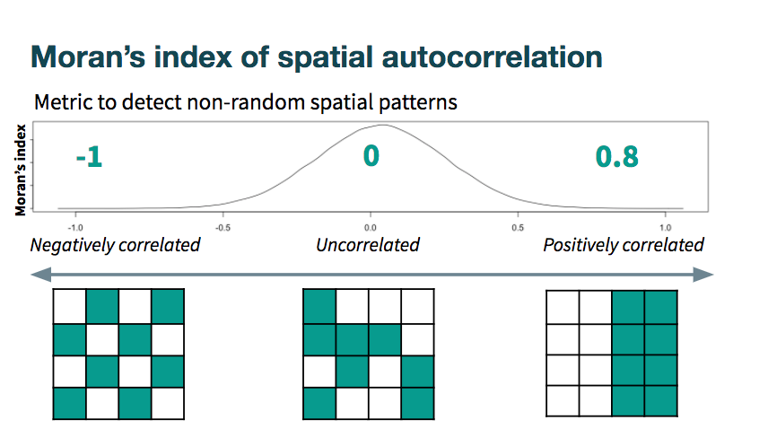
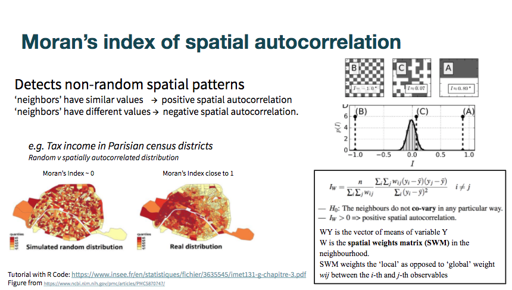
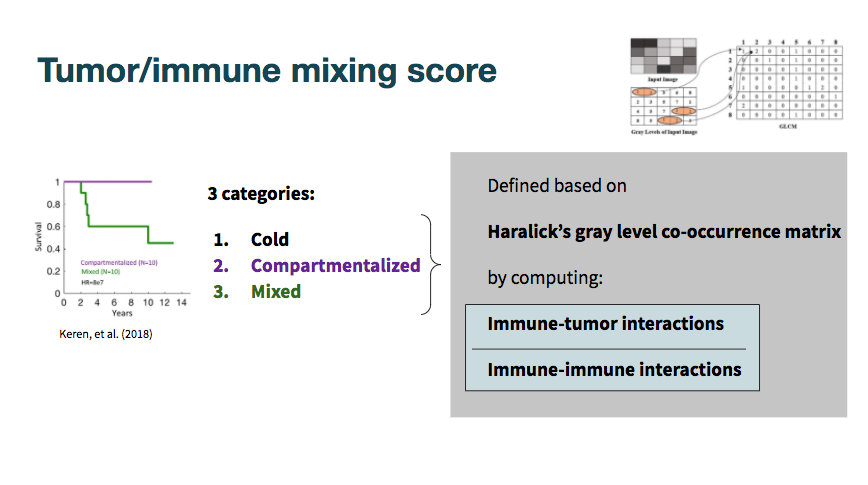
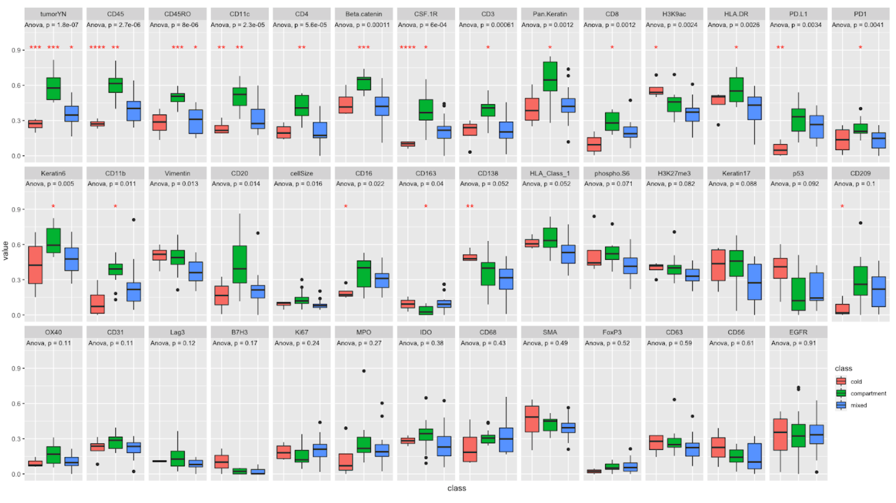

```{r setup, include=FALSE}
knitr::opts_chunk$set(echo = TRUE)
```

```{r packages, include=FALSE}
library(ggplot2)
library(reshape)
library(SingleCellExperiment)
library(ggpubr)
library(dplyr)
library(plyr)
```
# Introduction

In this vignette, I examine the Moran's index and its associations to the clinically prognostic tumor categories set forth by the authors in [*A Structured Tumor-Immune Microenvironment in Triple Negative Breast Cancer Revealed by Multiplexed Ion Beam Imaging*](https://pubmed.ncbi.nlm.nih.gov/30193111/).

{ width=95% }

Visit the [BIRSBiointegration Hackathon page](https://github.com/BIRSBiointegration/Hackathon) to read more about MIBI-TOF.

{ width=95% }

{ width=95% }
{ width=95% }

# Loading data

*resMoranTest.csv* is the output from running **compute_morans.R** on the mibiTOF segmented image files, downloadable here: https://www.angelolab.com/mibi-data

```{r}
datpath <- '../data'
load(file.path(datpath, 'moranRes.rda'))
```

```{r, eval = F}
moran <- read.csv(file.path(datpath,'resMoranTest.csv'))
colnames(moran)[1] <- "sample"
```

A key component used in computing Moran's I is the spatial weighting matrix (SWM). This can be formed from any number of ways, including by various distance metrics (e.g., Euclidean), by graphs, or any other ways of defining proximity in space. 

{ width=95% }

We used SWM defined by Gabriel neighborhoods, which is a special case of a Delaunay graph (constructed from Voronoi tesselation). Delaunay graphs are constructed by drawing edges between all nodes with shared Voronoi faces (light blue edges and yellow nodes on the bottom right below). To then transform the graph into a Gabriel graph, edges are pruned if there are other points that lie within the smallest circle passing through those two points (e.g., in the red circles below), and edges are kept if not (e.g., in the green circle below).

{ width=95% }

*patient_class.csv* is included in the download from the link above. For each sample it contains the tumor  classification as defined in the paper:

{ width=95% }

```{r, eval = F}
tumor_class <- read.csv(file.path(datpath,'patient_class.csv'),header = TRUE)
names(tumor_class) <- c('sample','class')
tumor_class$sample <- paste0('p',tumor_class$sample)
tumor_class$class <- plyr::mapvalues(tumor_class$class, 
                               from = c(0, 1, 2), 
                               to = c('mixed','compartment','cold'))

moran <- dplyr::inner_join(moran, tumor_class, by = c('sample'))
```

# Moran plots

Computing p-values for 3-way ANOVA test of significance for Moran's I on the dummy variables (cell type flags) and each protein expression level.

```{r, message = F}
moran_aov <- moran[,-1]
moran_aov$class <- as.factor(moran_aov$class)

feats <- colnames(moran_aov)[-42]

pvals <- data.frame(matrix(NA, ncol = 2, nrow = length(feats)))
colnames(pvals) <- c('feat','aov_pval')
rownames(pvals) <- feats

for (feat in feats){
  pvals[feat,] <- c(feat,summary(aov(moran_aov[,feat] ~ moran_aov[,'class']))[[1]][['Pr(>F)']][1])
}

pvals$aov_pval <- as.numeric(pvals$aov_pval)

pvals <- pvals[order(pvals$aov_pval),]

```

Individual ANOVA tests:
(3 sets; for each, the other 2 groups are coded together as "other")

```{r, message = F}
moran_aov_sep <- moran[,-1]
moran_aov_sep$class_cold <- as.factor(plyr::mapvalues(moran_aov_sep$class, 
                               from = c('mixed','compartment','cold'), 
                               to = c('other','other','cold')))
moran_aov_sep$class_mixed <- as.factor(plyr::mapvalues(moran_aov_sep$class, 
                               from = c('mixed','compartment','cold'), 
                               to = c('mixed','other','other')))
moran_aov_sep$class_comp <- as.factor(plyr::mapvalues(moran_aov_sep$class, 
                               from = c('mixed','compartment','cold'), 
                               to = c('other','compartment','other')))

feats <- colnames(moran_aov_sep)[c(-45:-42)]

pvals_sep <- data.frame(matrix(NA, ncol = 4, nrow = length(feats)))
colnames(pvals_sep) <- c('feat','test_cold','test_mixed','test_comp')
rownames(pvals_sep) <- feats

for (feat in feats){
  pvals_sep[feat,] <- c(feat,
                        summary(aov(moran_aov_sep[,feat] ~ moran_aov_sep[,'class_cold']))[[1]][['Pr(>F)']][1],
                        summary(aov(moran_aov_sep[,feat] ~ moran_aov_sep[,'class_mixed']))[[1]][['Pr(>F)']][1],
                        summary(aov(moran_aov_sep[,feat] ~ moran_aov_sep[,'class_comp']))[[1]][['Pr(>F)']][1])
}

pvals_sep[rownames(pvals),]

```

# Visualizing Moran's I across groups

Comparing Moran's I scores across the clinical prognosis categories on the tumor cell dummy variable:

(Moran's I is computed where the measurement in each cell is 1 or 0, for whether is is or is not a tumor cell, providing a measure of spatial autocorrelation of tumor cells within the sample.)

```{r, message = F}
ggplot(moran, aes(x=class, y=tumorYN)) + 
  geom_boxplot(aes(fill = class)) 
```

Here, we can see the differences when visualized alongsidem images of the tumors (tumor images as published by Keren et al. 2018)

{ width=95% }

Comparing all attributes:

(Each panel corresponds to a given attribute, mostly proteins, and shows the differences in spatial autocorrelation, as quantified with Moran's I, across the clinical groups. Panels are sorted by p-value of 3 way anova, and include <span style="color: red;">\*</span>s to indicate their significance level in the "each vs rest" ANOVA tests.)

```{r, message = F}
moran_melt <- melt(moran,id.vars = c('sample','class'))
moran_melt$variable <- factor(moran_melt$variable, levels = rownames(pvals)) # sort panels by 3way anova pval

mm <- ggplot(moran_melt, aes(x=class, y=value)) + 
  geom_boxplot(aes(fill = class)) + facet_wrap(. ~ variable, nrow = 3) +
  stat_compare_means(method = "anova", label.y = 1.1, size = 3) +      # Add global p-value
  stat_compare_means(label = "p.signif", method = "t.test",
                     ref.group = ".all.", hide.ns = TRUE, color = 'red', size = 3) +
  theme(axis.text.x=element_blank(),
        axis.ticks.x=element_blank())

```

{ width=100% }

Defining some proteins that may be interesting to consider together, due to related cell types / function:

```{r, message = F}
immune_subset <-c('CD45','CD45RO', 'CD3','CD8', 'CD16','CD163','HLA.DR')
immune_subset2 <-c('CD45','CD45RO', 'CD3','CD8', 'CD16','CD163','HLA.DR', 'CD11c')
monocyte_subset <- c('CD11b','CD11c','CD68','CD63')
im_reg_subset <- c('PD1','PD.L1')
tum_subset <- c('tumorYN', 'Beta.catenin', 'Pan.Keratin', 'Keratin6', 'EGFR', 'p53')
lymphocytes <- c('CD45','CD3','CD8','CD4','CD20','CD45RO','CD56','CD16','CD138')
antigen_prez <- c('HLA.DR','HLA_Class_1', 'CD209')
```

Examining a few of the protein subsets

```{r, message = F}

for(cur_sub in list(immune_subset, monocyte_subset, tum_subset, lymphocytes, antigen_prez)){
  moran_melt <- melt(moran[,c('sample','class',cur_sub)],id.vars = c('sample','class'))
  moran_melt$variable <- factor(moran_melt$variable, 
                                levels = rownames(pvals)[rownames(pvals) %in% cur_sub]) 
  # sort panels by 3way anova pval
  
  ggplot(moran_melt, aes(x=class, y=value)) + 
    geom_boxplot(aes(fill = class)) + facet_wrap(. ~ variable, ncol = 5) +
    stat_compare_means(method = "anova", label.y = 1.1, size = 3) +      # Add global p-value
    stat_compare_means(label = "p.signif", method = "t.test",
                       ref.group = ".all.", hide.ns = TRUE, color = 'red', size = 5) +
    theme(axis.text.x=element_blank(),
          axis.ticks.x=element_blank())
  moranHM <- moran[,-c(1,43)]
  moranHM <- moranHM[,cur_sub]
  rownames(moranHM) <- paste(moran$sample,moran$class,sep = ': ')
  show(ComplexHeatmap::Heatmap(moranHM))
}
```


# Additional visualizations

Biplot: samples labeled by tumor class and proteins

```{r}
moran_bip <- corral::na2zero(moran_aov[,-42])
rownames(moran_bip) <- paste(moran$sample,moran$class,sep = ': ')
prc_moran <- prcomp(moran_bip)
biplot(prc_moran)
```


Heatmap of the Moran's I values per protein, per sample.

```{r}
moranHM <- moran[,-c(1,43)]
rownames(moranHM) <- paste(moran$sample,moran$class,sep = ': ')
ComplexHeatmap::Heatmap(moranHM)
```


